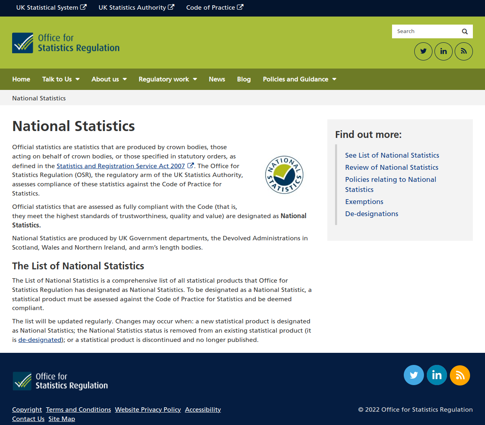
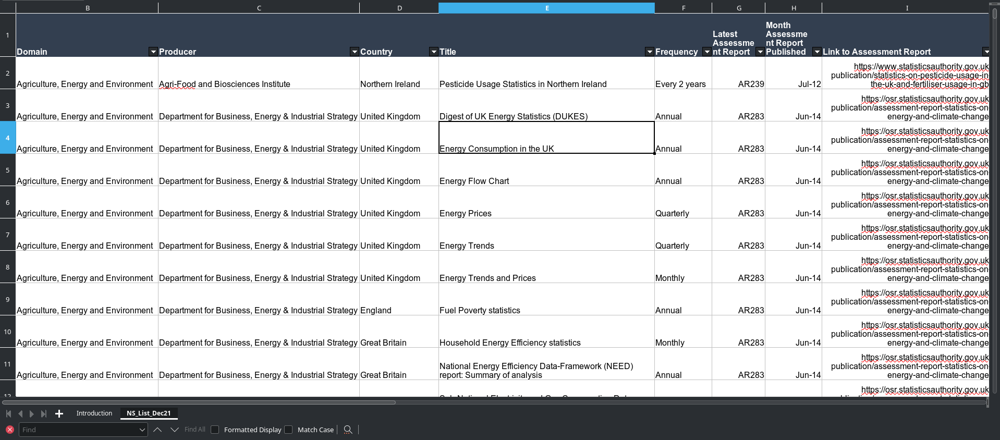
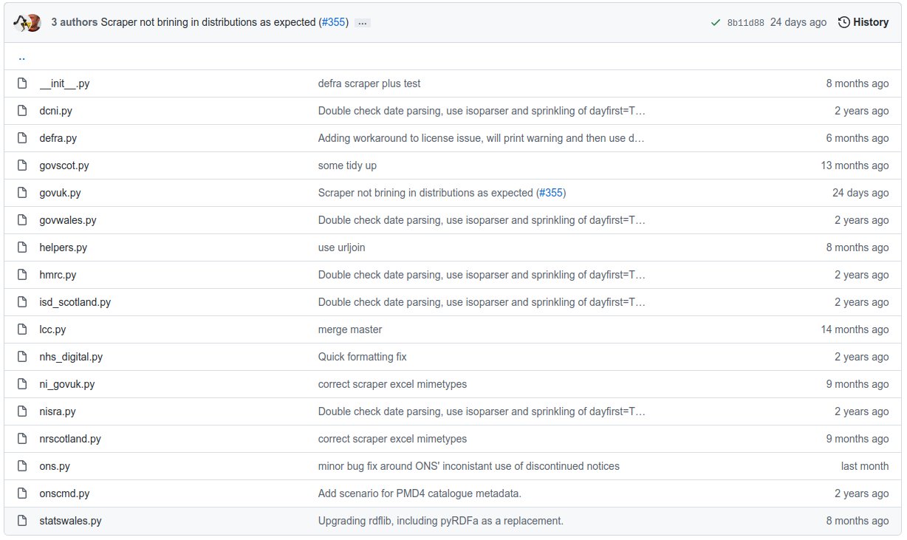

## Official Statistics list 2015/16

* Snapshot of Official Statistics published on gov.uk from 2015/16.
* Generated from Whitehall as a CSV dump by an admin.
* Curated in a [Google Spreadsheet](https://docs.google.com/spreadsheets/d/1umTgnVbE3Bw83Beh5-o1H5B3f3jc8AoML2Tav927_Lc).
* One big spreadsheet with a tab per publisher listing datasets from that publisher with a line per tab in the published spreadsheet.
* It's spreadsheets all the way down.

---


---

## Solar System of Statistics

Originally based on this spreadsheet, looking at the shared dimensions, it quickly collapsed in on itself.


---

## ONS Census

Based on some data extracted from census, organised around topics / dimensions.


---

## Stats registry

* Automate the spreadsheet.
* Take JSON feeds from:
  * https://www.gov.uk/government/statistics.json
  * https://api.ons.gov.uk/dataset?start={start}&limit={limit}
  * Existing spreadsheet; to merge with curated metadata.
* Schemas are different &mdash; what is a dataset?
* Keep local relational tables up to date, nightly.

---

E.g. gov.uk object relational mapping:
```language-python
class Organisation(SQLObject):
    class sqlmeta:
        table = 'wh_organisation'
    uri = StringCol(alternateID=True, length=255)
    label = StringCol()
    datasets = RelatedJoin('Dataset')


class Dataset(SQLObject):
    class sqlmeta:
        table = 'wh_dataset'
    whitehall_id = IntCol(alternateID=True)
    stats_type = EnumCol(enumValues=['Official Statistics', 'National Statistics', 'Statistical data set', None],
                         default=None)
    title = StringCol()
    url = StringCol(alternateID=True, length=255)
    orgs = RelatedJoin('Organisation')
    publication_date = DateTimeCol()
    government_name = StringCol()
    collections = RelatedJoin('Collection')


class Collection(SQLObject):
    class sqlmeta:
        table = 'wh_collection'
    uri = StringCol()
    label = StringCol()
    datasets = RelatedJoin('Dataset')


Organisation.createTable(ifNotExists=True)
Dataset.createTable(ifNotExists=True)
Collection.createTable(ifNotExists=True)
```
---

E.g. ONS object relational mapping:

```language-python
class Dataset(SQLObject):
    class sqlmeta:
        table = 'ons_dataset'
    uri = StringCol(alternateID=True, length=511)
    title = StringCol()
    summary = StringCol()
    keywords = RelatedJoin('Keyword')
    distributions = RelatedJoin('Distribution')


class Distribution(SQLObject):
    class sqlmeta:
        table = 'ons_distribution'
    uri = StringCol()
    national_statistic = BoolCol()
    version = StringCol()
    edition = StringCol()
    release_date = DateTimeCol()
    next_release = DateCol()
    contacts = RelatedJoin('Contact')


class Keyword(SQLObject):
    class sqlmeta:
        table = 'ons_keyword'
    keyword = StringCol(alternateID=True, length=255)

class Contact(SQLObject):
    class sqlmeta:
        table = 'ons_contact'
    email = StringCol()
    name = StringCol()
    telephone = StringCol()
    datasets = RelatedJoin('Distribution')


Dataset.createTable(ifNotExists=True)
Distribution.createTable(ifNotExists=True)
Keyword.createTable(ifNotExists=True)
Contact.createTable(ifNotExists=True)

```
---

## Why relational when we want RDF?

* Not clear how we should interpret as DCATv2.
* Want to avoid hard-coding.
* Object-relational &rarr; RDF using D2R / R2RML:

```language-turtle
# Table dataset
map:ons_dataset a d2rq:ClassMap;
        d2rq:dataStorage map:database;
        d2rq:class ons:Dataset;
        d2rq:classDefinitionLabel "dataset";
        d2rq:uriColumn "ons_dataset.uri";
        .
map:ons_dataset__label a d2rq:PropertyBridge;
        d2rq:belongsToClassMap map:ons_dataset;
        d2rq:property rdfs:label;
        d2rq:column "ons_dataset.title";
        .
map:ons_dataset_summary a d2rq:PropertyBridge;
        d2rq:belongsToClassMap map:ons_dataset;
        d2rq:property ons:dataset_summary;
        d2rq:propertyDefinitionLabel "dataset summary";
        d2rq:column "ons_dataset.summary";
        .

# Table ons_distribution
map:ons_distribution a d2rq:ClassMap;
        d2rq:dataStorage map:database;
        d2rq:class ons:Distribution;
        d2rq:classDefinitionLabel "distribution";
        d2rq:uriPattern "ons_distribution/@@ons_distribution.id@@";
        .
map:ons_distribution_national_statistic a d2rq:PropertyBridge;
        d2rq:belongsToClassMap map:ons_distribution;
        d2rq:property ons:distribution_national_statistic;
        d2rq:propertyDefinitionLabel "distribution national_statistic";
        d2rq:column "ons_distribution.national_statistic";
        d2rq:datatype xsd:boolean;
```

---

<!-- .slide: data-background-iframe="https://solar.ukstats.dev" -->

---

## Landscape refresh 2021

Paul Thomas refreshed the 2015/16 "landscape" work last year, again taking a snapshot from Whitehall.

Paul gave a presentation last year on some findings, e.g. ~ 4k datasets per year and rising.

---

## Office for Statistics Regulation
List of National Statistics



---

## Another spreadsheet

No identifiers or links, just titles ☹



---

## data.gov.uk

<!-- .slide: data-background-iframe="https://guidance.data.gov.uk/get_data/api_documentation/" -->
<!-- .slide: class="drop" -->

https://data.gov.uk/api/action/package_list as JSON

---

## DCAT 🐱

<!-- .slide: data-background-iframe="https://guidance.data.gov.uk/publish_and_manage_data/harvest_or_add_data/harvest_data/dcat/#accepted-dcat-and-data-json-fields" -->
<!-- .slide: class="drop" -->

---

## Transformation Jobs

All the Jenkins transformation jobs follow the same process:

1. Given a `dcat:landingPage`, get the DCATv2 metadata.
2. Find the latest dataset, maybe based on title, or in a given collection.
3. Grab the latest `dcat:distribution`
4. Transform, usually a spreadsheet, into Tidy Data as CSV.

---

## Scrapers



---

<!-- .slide: data-background-iframe="https://content-api.publishing.service.gov.uk/#gov-uk-content-api" -->

---

Harvesting DCATv2 metadata

```language-plantuml
@startuml
!theme cyborg
skinparam defaultTextAlignment center
skinparam noteTextAlignment left
left to right direction

database metadata {
  rectangle gov.uk
  rectangle ONS
  rectangle StatsWales
  rectangle Others as "..."
}

rectangle dailyPoll as "Daily poll
--
* Fetch publication feeds
* Update tables
* Use scrapers
"
dailyPoll --> metadata
metadata -() R2RML

node "Publish My Data" {
  database "RDF"
  component Drafter
}
() drafterAPI as "Drafter\nAPI"
drafterAPI -- Drafter

rectangle gov_uk_site as "gov.uk"
gov_uk_site -> dailyPoll
rectangle ons_gov_uk_site as "gov.uk"
ons_gov_uk_site -> dailyPoll
rectangle statswales_site as "statswales.gov.wales"
statswales_site -> dailyPoll


component dailyDCAT as "daily DCAT"
R2RML )-> dailyDCAT
dailyDCAT --( drafterAPI
@enduml
```

---

## Harvest Data

```language-plantuml
@startuml
scale max 700 height
!theme cyborg
package data.gov.uk {
    database PMD
}
rectangle "x.data.gov.uk" {
  file CSVW_1 as "CSVW"
  CSVW_1 --> PMD
}
rectangle "Cloud Run" {
   queue Transform_1
   Transform_1 --> PMD
}
rectangle "gov.uk" {
  file CSVW_2 as "CSVW"
  CSVW_2 --> PMD
  file XLS_1 as "Excel"
  XLS_1 --> Transform_1
}
interface SPARQL
PMD -() SPARQL
@enduml
```

---

## data.gov.uk

<!-- .slide: data-background-image="https://images.squarespace-cdn.com/content/v1/550aaed7e4b0f34c8f7899a4/1499510570990-537085PW8LZKKB79DWM9/ancient_map.jpg" -->
<!-- .slide: class="drop" -->

* Uses CKAN
* Not necessarily up to date
* Difficult to figure out authoritative sources
* Needs some love ❤️

---

## data.gov.uk v2

<!-- .slide: data-background-image="new-map.png" -->
<!-- .slide: class="drop" -->


* Trusted
* Up to date
* Authoritative
* Standardised formats
* Search Engine Optimised
* Not just stats?

---

<!-- .slide: data-background-image="https://memegenerator.net/img/instances/66320224/im-going-to-have-to-science-the-shit-out-of-this.jpg" -->
